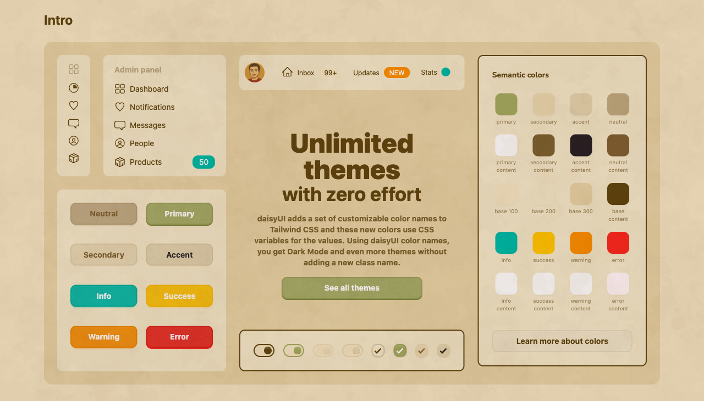
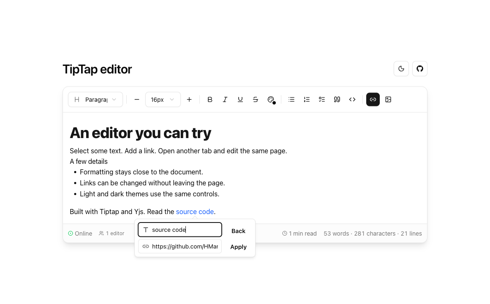
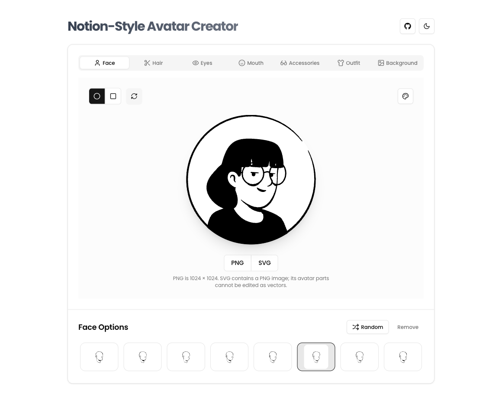
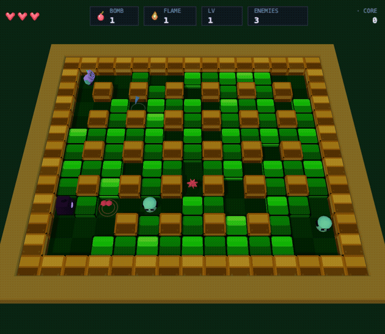

# Hi, I'm Harvey

I build web apps and developer tools, and spend a lot of time on the interface. Recently, that’s meant collaborative editors, a DaisyUI theme, an avatar maker, and a browser game.

### Matsu

Warm colors, paper texture, and DaisyUI components. I built the component demo and installer around the Matsu theme.

[Explore the theme](https://hmarzban.github.io/daisyui-matsu-theme/) · [Source](https://github.com/HMarzban/daisyui-matsu-theme)

### Editor playground

An editor for trying link editing, themes, and collaboration. Open it in two browser tabs to try the sync.

<a href="https://hmarzban.github.io/tiptap-editor-demo/">
  <picture>
    <source media="(prefers-color-scheme: dark)" srcset="assets/profile/tiptap-editor-dark.png" />
    <source media="(prefers-color-scheme: light)" srcset="assets/profile/tiptap-editor-light.png" />
    
  </picture>
</a>

[Try the editor](https://hmarzban.github.io/tiptap-editor-demo/) · [Source](https://github.com/HMarzban/tiptap-editor-demo)

### Avatar maker

Pick the parts, change the background, and download an avatar. The artwork is from DrawKit; I built the editor around it.

[Make an avatar](https://hmarzban.github.io/notion-avatar-generator/) · [Source](https://github.com/HMarzban/notion-avatar-generator)

### Fusegrid

A browser arcade game with 2D and 3D views of the same simulation.

<a href="https://hmarzban.github.io/fusegrid/">
  <picture>
    <source media="(prefers-reduced-motion: reduce)" srcset="assets/profile/fusegrid-still.png" />
    
  </picture>
</a>

[Play](https://hmarzban.github.io/fusegrid/) · [Source](https://github.com/HMarzban/fusegrid) · [Still preview](assets/profile/fusegrid-still.png)

### Ongoing work

I contribute to **[docs.plus](https://github.com/docs-plus/docs.plus)**, a collaborative document editor, working on editor extensions, real-time behavior, and deployment. [Open docs.plus](https://docs.plus) · [Smaller images, faster builds](case-studies/docs-plus-builds.md).

### Tools I use

Mostly TypeScript, React, Node.js, and collaborative editing with Tiptap, ProseMirror, Hocuspocus, and Yjs. Learning Elixir and Zig.

More tools I've worked with

<table>
  <tr>
    <td><strong>Languages</strong></td>
    <td>
      
      
      
    </td>
  </tr>
  <tr>
    <td><strong>Frontend</strong></td>
    <td>
      
      
      
      
      
      
      
    </td>
  </tr>
  <tr>
    <td><strong>Collaborative editing</strong></td>
    <td>
      
      
      
    </td>
  </tr>
  <tr>
    <td><strong>Backend &amp; data</strong></td>
    <td>
      
      
      
      
      
      
      
      
    </td>
  </tr>
  <tr>
    <td><strong>Cloud &amp; deployment</strong></td>
    <td>
      
      
      
    </td>
  </tr>
  <tr>
    <td><strong>Tools</strong></td>
    <td>
      
      
      
    </td>
  </tr>
  <tr>
    <td><strong>Hardware</strong></td>
    <td>
      
      
    </td>
  </tr>
</table>

Earlier contributions: [Etherpad](https://github.com/ether/etherpad/pull/6152) · [Mozilla Add-ons](https://github.com/mozilla/addons-frontend/pull/6890) · [Liara CLI](https://github.com/liara-cloud/cli/pull/4). [Earlier projects](EARLIER-WORK.md).

[Email](mailto:marzban98@gmail.com) · [X](https://x.com/mhossein_)
